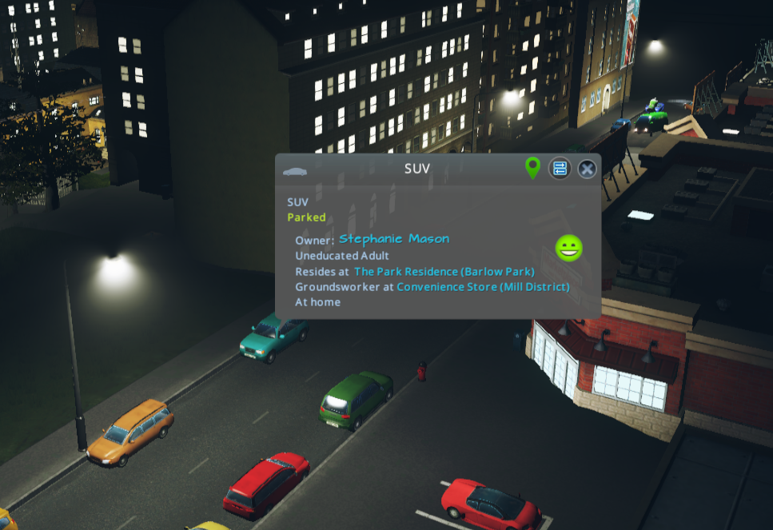
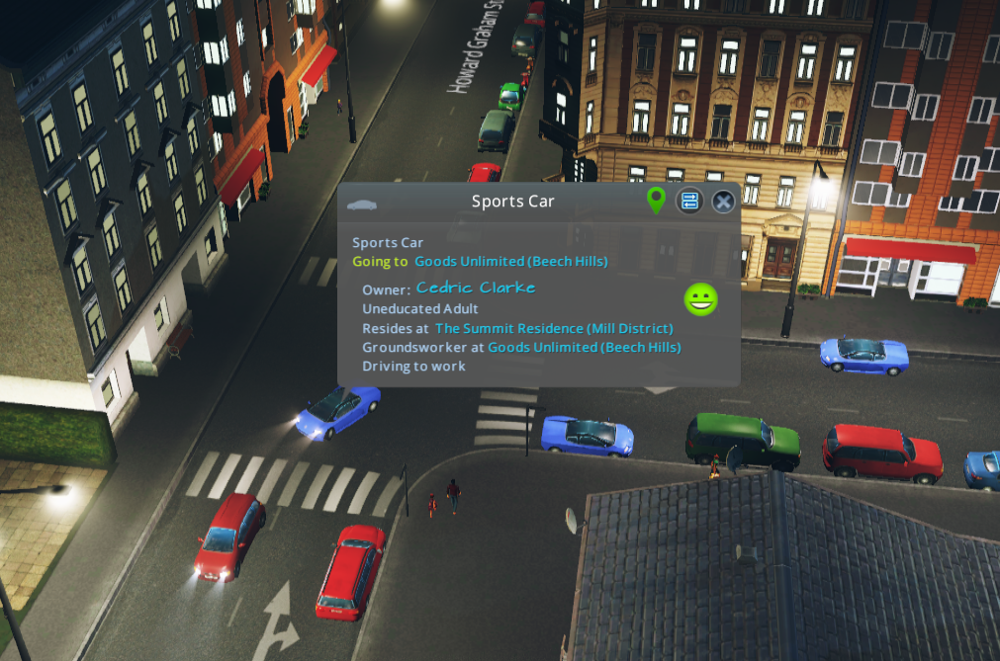
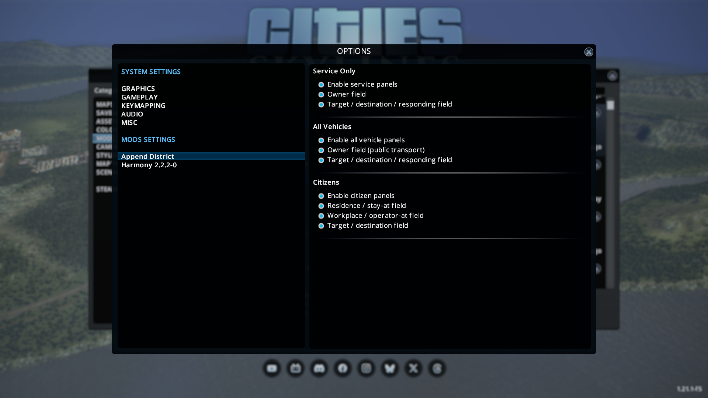
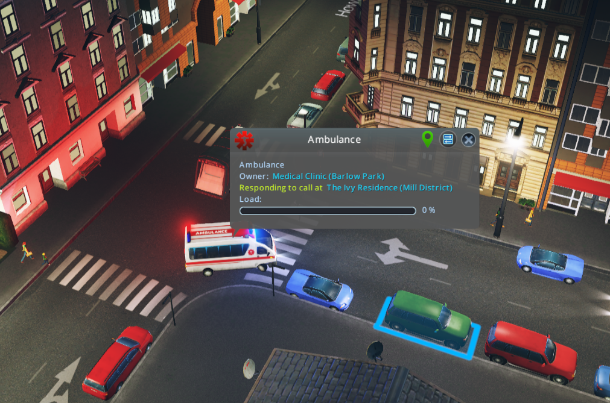
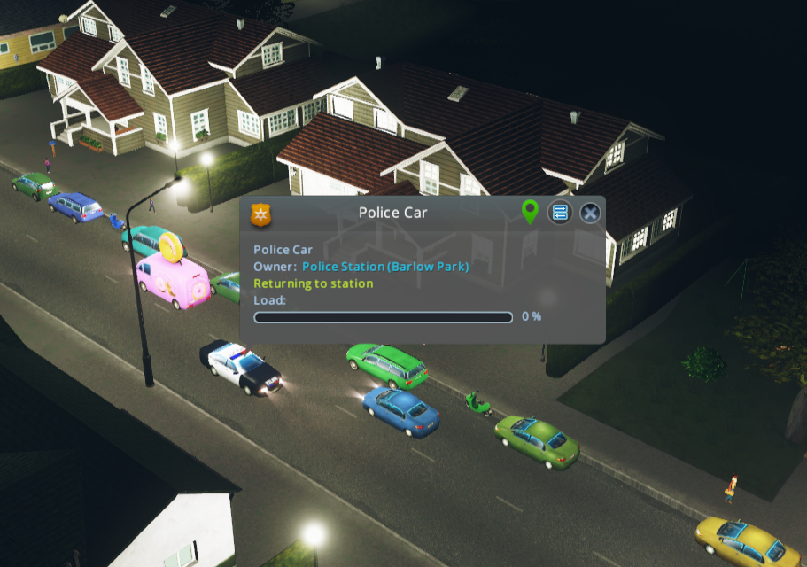

# Append District

Append District is a **Cities: Skylines (CS1)** mod that appends district names to selected **vehicle** and **citizen** fields in World Info panels.

This allows you to quickly see **which district a vehicle or citizen is associated/heading with/to**, making it easier to understand traffic, services, and citizen behaviour in your city.

**[Steam Workshop Item](https://steamcommunity.com/sharedfiles/filedetails/?id=3683007026)**

## What It Does

- Appends district names to owner/target-style panel fields.
- Supports service-only, all-vehicle, and citizen panels.
- Exposes per-panel/per-field toggles in game options.

## Requirements

- Cities: Skylines (CS1).
- Harmony available to the game (`0Harmony.dll` or CitiesHarmony Harmony DLL).
- .NET SDK with `net472` support.

## Build

```bash
dotnet build AppendDistrict.sln
```

### Build Outputs

- Compiled output: `$(BuildOutputRoot)/bin/`
- Intermediate files: `$(BuildOutputRoot)/obj/`
- Post-build copy target: `ModOutputDir`

If `ModOutputDir` is resolved, the built DLL is copied there automatically.

## Path Resolution

The project attempts to auto-detect these paths:

- `CitiesSkylinesManagedDir`
- `HarmonyDllPath`
- `ModOutputDir`
- `BuildOutputRoot`

Auto-detection includes common Linux, Windows, and macOS Steam/CS1 locations.

If detection fails, use either:

1. A local override file: copy `Directory.Build.user.props.example` to `Directory.Build.user.props` and set values.
2. CLI overrides:

```bash
dotnet build AppendDistrict.sln \
  -p:CitiesSkylinesManagedDir="/path/to/Cities_Skylines/Cities_Data/Managed" \
  -p:HarmonyDllPath="/path/to/0Harmony.dll" \
  -p:ModOutputDir="/path/to/Cities_Skylines/Addons/Mods/AppendDistrict" \
  -p:BuildOutputRoot="/tmp/AppendDistrict"
```

## In-Game Settings

Open `Options -> Mods -> Append District`.

For a field to be modified, both of these must be enabled:

- the group toggle (`Enable ... panels`)
- the field toggle inside that same group

### Settings Mapping

| Setting | Panel(s) Affected | Behavior |
| --- | --- | --- |
| `Enable service panels` | `CityServiceVehicleWorldInfoPanel` | Master switch for all `Service Only` field updates. |
| `Owner field` (`Service Only`) | Service vehicle panel | Appends district to the owner field (`m_Owner`). |
| `Target / destination / responding field` (`Service Only`) | Service vehicle panel | Appends district to the target/responding field (`m_Target`). |
| `Enable all vehicle panels` | `PublicTransportVehicleWorldInfoPanel`, `VehicleWorldInfoPanel` | Master switch for all `All Vehicles` field updates. |
| `Owner field (public transport)` | Public transport vehicle panel | Appends district to the owner field (`m_Owner`). |
| `Target / destination / responding field` (`All Vehicles`) | Generic vehicle panel (`VehicleWorldInfoPanel`) | Appends district to the target field (`m_Target`) for non-service/non-public-transport panels. |
| `Enable citizen panels` | `HumanWorldInfoPanel`, `CitizenWorldInfoPanel`, `TouristWorldInfoPanel` | Master switch for all `Citizens` field updates. |
| `Residence / stay-at field` | Citizen and tourist panels | Appends district to citizen residence (`m_Residence`) and tourist hotel (`m_Hotel`) fields. |
| `Workplace / operator-at field` | Human panel | Appends district to workplace field (`m_Workplace`). |
| `Target / destination field` | Human panel | Appends district to target field (`m_Target`). |

## Troubleshooting

- Mod not listed in Content Manager:
  Build once and verify `AppendDistrict.dll` exists inside your active `Addons/Mods/AppendDistrict` folder.
- Build error about missing `Assembly-CSharp.dll` / `ICities.dll`:
  Set `CitiesSkylinesManagedDir`.
- Build error about missing Harmony DLL:
  Set `HarmonyDllPath`.
- Build succeeds but old behavior in game:
  Fully restart CS1 (not only reload a save).

## License

MIT. See `LICENSE`.

## Screenshots

<p align="center">



</p>

<p align="center">


</p>
